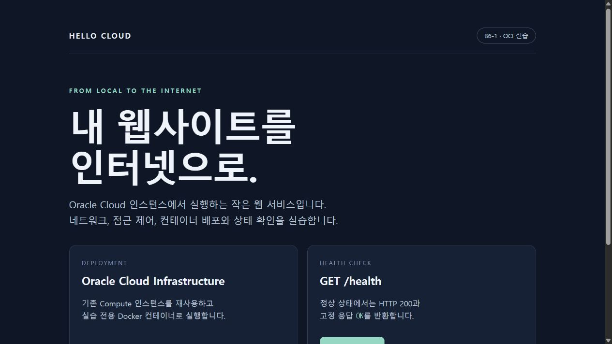
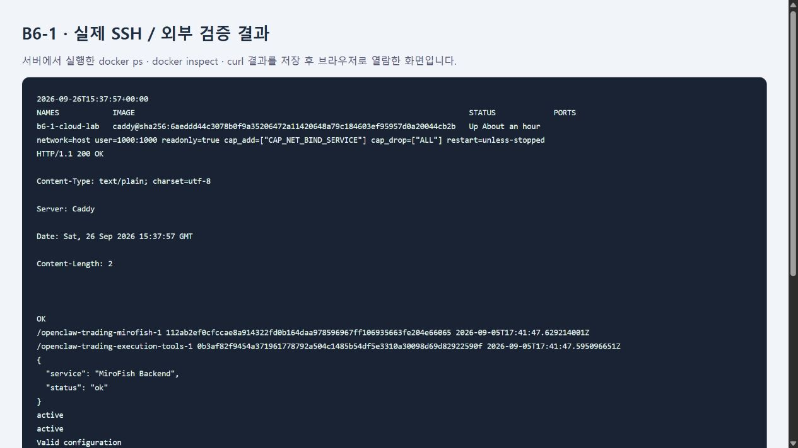

# B6-1 · OCI에서 내 웹사이트 공개하기

AWS 과제를 Oracle Cloud Infrastructure(OCI)에 대응해 구현한 실습이다. 기존 무료 범위의 `ai-research` 인스턴스와 네트워크를 재사용하며, 사용자가 명시적으로 원복을 요청하기 전까지 서비스를 유지한다.

## 접속과 제출물

**최종 접속 주소: [https://www.codyssey-domain-test.kro.kr/](https://www.codyssey-domain-test.kro.kr/)** — 2026-09-27 01:03 KST HTTPS와 인증서 검증 완료.

- **외부 검증 방식 A:** 브라우저에서 [웹 페이지](http://152.67.213.106/) 정상 표시 확인.
- 방식 B도 확인: [GET /health](http://152.67.213.106/health) → **HTTP 200**, 본문 `OK`.
- 검증 시각: **2026-09-27 00:37 KST**. Windows PC에서 직접 공인 IP로 호출했다.
- [아키텍처 PNG](docs/architecture.png), [트러블슈팅](docs/troubleshooting.md), [원복 체크리스트](docs/cleanup-checklist.md), [IAM 설정](docs/iam.md).
- 명령 원문: [외부 HTTP](evidence/http-after.txt), [서버·Docker·기존 서비스](evidence/final-server.txt), [IAM 허용·거부](evidence/iam.txt), [네트워크](evidence/network-after.txt).



아래는 실제 SSH 명령 출력을 저장한 뒤 브라우저로 열람한 화면이다. `docker ps`의 Up 상태와 localhost HTTP 200을 보여준다. 원문은 `evidence/final-server.txt`에 있다.



## AWS 요구사항과 OCI 대응

| 원래 과제 | 이번 구현 | 검증 |
|---|---|---|
| VPC 생성 | 기존 `vcn-ai-research`, `10.10.0.0/16` 재사용 | OCI API 조회 |
| Public Subnet 생성 | 기존 `research-subnet`, `10.10.1.0/24` 재사용 | 공인 IP 허용, private IP `10.10.1.250` |
| Internet Gateway·Route Table | 기존 `ai-research-igw` 및 기본 라우트 재사용 | `0.0.0.0/0 → IGW`, IGW enabled |
| EC2 생성 | 기존 OCI A1.Flex `ai-research`, 4 OCPU / 24 GB | SSH·기존 서비스 확인 |
| Security Group | 전용 NSG `b6-1-web` + 기존 Security List + 호스트 UFW | TCP 80/443 공개, SSH 22는 `112.153.56.84/32` |
| IAM 사용자 또는 Role | 별도 계정 없이 `b6-1-ai-research` Dynamic Group + Instance Principal | 초기 준비와 역할 실습을 구분; [실제 조회·규칙 재적용·권한 거부 증빙](evidence/limited-role.json) |
| 웹 서버 | Caddy Docker 컨테이너 | 내부·외부 HTTP 200 |
| 종료·삭제 | **사용자 지시로 실행하지 않음** | 변경 명세와 향후 원복 순서 기록 |

트래픽은 외부 → 기존 Internet Gateway → public subnet → NSG/Security List → UFW → Caddy 순서로 전달된다. NSG와 Security List는 허용 규칙이 합쳐지므로, NSG만 좁혀도 기존 Security List의 넓은 허용은 사라지지 않는다. 따라서 기존 SSH 허용 규칙의 source를 개인 IP `/32`로 변경했다. UFW의 기존 SSH 규칙은 보존했으며 OCI 계층에서 공인 SSH를 제한한다.

NSG는 네트워크 패킷의 출입을, IAM은 OCI API로 어떤 리소스를 조회·변경할 수 있는지를 제어한다. 정확한 리소스 식별자는 [oci-resources.json](docs/oci-resources.json)에 기록했다. 비밀키·계정 설정은 이 저장소에 넣지 않는다.

## Docker 실행

- 이미지: `caddy:2-alpine`, 실제 배포는 [image.txt](image.txt)의 digest로 고정.
- digest: `sha256:6aeddd44c3078b0f9a35206472a11420648a79c184603ef95957d0a20044cb2b`.
- 이름: `b6-1-cloud-lab`, 라벨 `assignment=b6-1`.
- 실행 방식: [scripts/deploy.sh](scripts/deploy.sh)의 `docker run`, 재시작 정책 `unless-stopped`.
- **포트 매핑:** `--network host`이므로 `-p` 매핑 없음. 호스트 TCP 80/443을 직접 사용하며 UFW INPUT 규칙이 적용된다. Caddy 관리 포트는 `127.0.0.1:2019`에 한정한다. UDP 443은 공개하지 않는다.
- 사용자 `1000:1000`, 읽기 전용 루트, capability는 `NET_BIND_SERVICE`만 허용. 메모리 128 MiB, CPU 0.5, PID 100, 로그 5 MiB × 2로 제한.
- 전용 경로 `/opt/b6-1-cloud-lab`: 웹 파일·구성 읽기 전용 마운트, `data/`·`config/`만 쓰기 가능.

신규 배포 시 이 저장소의 `Caddyfile`, `image.txt`, `site/`와 스크립트를 해당 서버 경로에 복사한 뒤 실행한다. 이미 실행 중인 컨테이너나 사용 중인 포트가 있으면 배포 스크립트가 중단한다. 네트워크 설정은 자동으로 덮어쓰지 않으며 위 문서의 NSG/UFW 상태를 확인한다.

```bash
sudo bash /opt/b6-1-cloud-lab/deploy.sh
curl --fail --include http://127.0.0.1/health
```

외부 PC에서 재검증:

```bash
python scripts/verify.py
```

## 도메인·HTTPS 상태

사용 도메인: `www.codyssey-domain-test.kro.kr`. DNS 관리 화면에서 **IP연결(A)** 체크, 왼쪽 호스트에 `www`, 오른쪽에 `152.67.213.106`을 입력한다. 웹포워딩·AAAA·CNAME은 필요하지 않다. 도메인 전체를 호스트 칸에 넣거나 IP에 `http://`·포트를 붙이지 않는다.

2026-09-27 00:53 KST에 공용 DNS 두 곳(1.1.1.1/8.8.8.8), 로컬 PC, 서버에서 `www` A 레코드가 공인 IP로 해석됨을 확인했다. apex는 설정하지 않았으며 **주소에 `www`를 포함**해야 한다. HTTP 도메인 접속은 HTTPS로 308 리다이렉트된다. [DNS 검증](evidence/dns-verified.txt) 참고.

Let's Encrypt 공유 `kro.kr` 발급 한도 429가 발생했으나, 안내된 재시도 시각 이후 Caddy 설정을 한 번 재적용하여 **공개 인증서 발급과 HTTPS 보너스 검증을 완료**했다. 공인 IP HTTP도 계속 제공한다.

- 외부 HTTPS `/` → 200, `/health` → 200 + `OK`: [응답 증빙](evidence/https-after.txt).
- 인증서: Let's Encrypt `YE1`, SAN `www.codyssey-domain-test.kro.kr`, 만료 `2026-12-25 15:05 UTC`. 기본 CA 신뢰 및 호스트명 검증 통과, TLS 1.3 연결 확인: [인증서 메타데이터](evidence/tls-certificate.json).
- 발급 과정: [Caddy 로그](evidence/tls-issued.txt). Caddy의 인증서 저장·자동 갱신 설정 유지.
- 기존 컨테이너 ID·시작 시각 및 health 보존: [TLS 적용 후 검증](evidence/preservation-after-tls.txt).

```bash
python scripts/verify.py https://www.codyssey-domain-test.kro.kr
```


## 보존과 원복

기존 `openclaw-trading-mirofish-1`, `openclaw-trading-execution-tools-1`의 컨테이너 ID와 시작 시각은 실습 전후 동일하며 MiroFish health는 `ok`, Docker·NetBird는 `active`다. 인스턴스 재부팅·종료, 볼륨 삭제·확장, 기존 컨테이너 재시작은 수행하지 않았다.

원래 과제의 리소스 삭제 항목은 사용자 지시에 따라 **향후 원복 절차 작성**으로 대체했다. 새 VM·볼륨·Load Balancer·NAT Gateway·DB는 만들지 않았다. 기존 무료 범위를 유지한다는 전제로 진행했으며, 별도 Billing 감사나 무과금 보증을 수행한 것은 아니다. [원복 체크리스트](docs/cleanup-checklist.md)는 지금 실행할 지시가 아니다.
