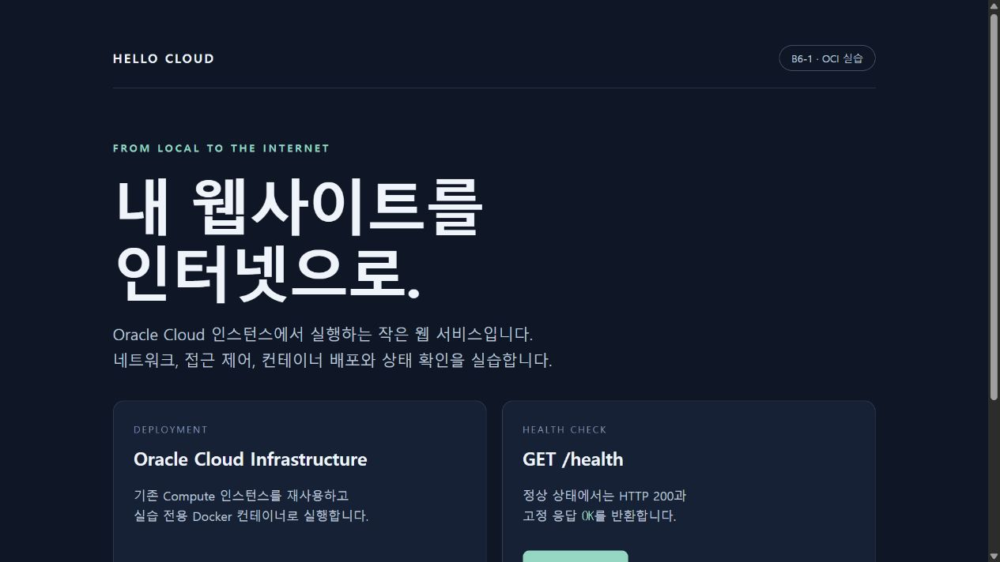
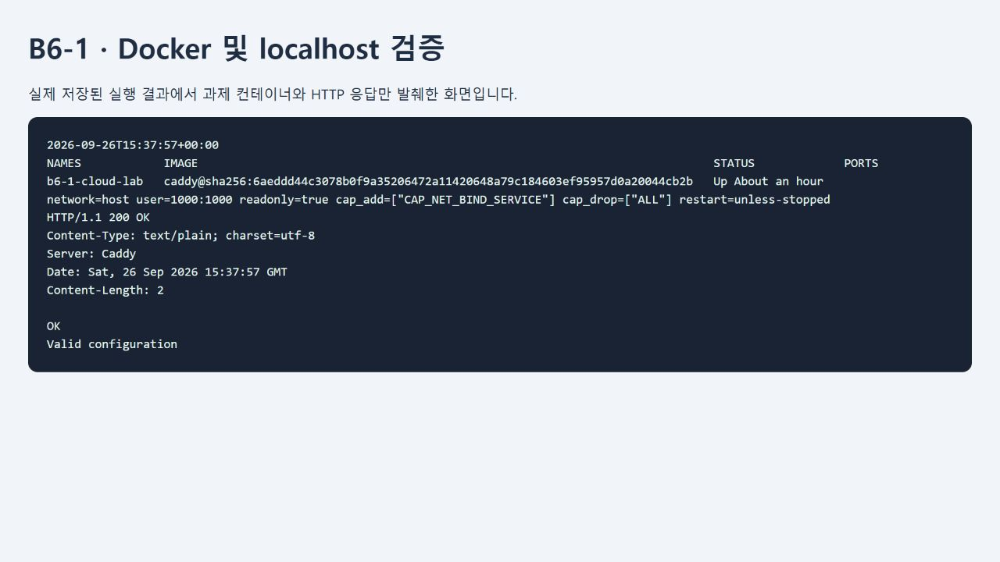
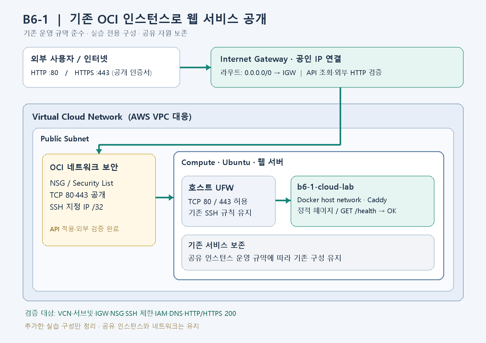

# B6-1 · OCI 웹 서비스 배포 실습

AWS의 VPC·EC2·Security Group을 OCI의 VCN·Compute·NSG에 대응한 실습이다. 기존 인스턴스 운영 규약에 따라 공유 자원을 재사용하고 실습 전용 컨테이너와 접근 규칙만 추가했다. 공유 인스턴스·볼륨·기존 서비스는 유지하며, 정리는 실습에서 추가한 구성에 한정한다.

## 제출물과 접속 검증

- HTTPS 연결 예정 URL: **https://www.codyssey-domain-test.kro.kr/** (현재 증빙은 공인 IP HTTP 기준)
- 선택한 외부 검증 방식: **A — 브라우저 접속**. 방식 B인 `/health`의 HTTP 200과 `OK`도 확인했다.
- 공인 IP HTTP 검증: [결과](evidence/http-after.txt). 서버 주소는 `<PUBLIC_IP>`로 치환했다.
- [아키텍처](docs/architecture.png), [IAM](docs/iam.md), [트러블슈팅](docs/troubleshooting.md), [정리 체크리스트](docs/cleanup-checklist.md).
- [실습 컨테이너와 내부 HTTP 검증](evidence/final-server.txt), [네트워크 확인](evidence/network-after.txt), [권한 허용·거부](evidence/iam.txt).
- 증빙은 실제 실행 결과에서 과제 관련 부분만 발췌했다. 개인 인프라의 이름·주소·식별자는 공개하지 않는다. [증빙 표기 기준](evidence/README.md).



아래는 저장한 실제 명령 출력 중 실습 컨테이너와 localhost 응답만 발췌해 브라우저로 열람한 화면이다.



## 구성

| 과제 요소 | OCI 적용 |
|---|---|
| VPC / Public Subnet | 기존 VCN 및 공인 IP 사용이 가능한 서브넷 재사용 |
| Internet Gateway / Route Table | 기존 IGW, `0.0.0.0/0 → IGW` 라우트 확인 |
| EC2 | 기존 Ubuntu Compute 인스턴스 재사용 |
| Security Group | 전용 NSG 및 기존 Security List, 호스트 UFW |
| 접근 제어 | HTTP80·HTTPS443 공개, SSH22는 지정 관리자 IP `/32`로 제한 |
| IAM | Instance Principal의 제한 역할로 네트워크 조회·NSG 규칙 수정 검증 |
| 웹 서버 | Caddy Docker 컨테이너, `/health` → `200 OK` |
| 정리 | 운영 규약에 따라 공유 자원 유지, 추가 구성의 원복 절차 작성 |

요청 흐름은 인터넷 → IGW → public subnet → NSG/Security List → UFW → Caddy다. NSG와 Security List의 허용은 합쳐지므로 어느 한쪽의 불필요한 허용도 함께 점검한다. IAM은 네트워크 통신이 아니라 OCI API 작업 권한을 제어한다.



## 배포와 검증

- 이미지: `caddy:2-alpine`, 배포 시 [image.txt](image.txt)의 digest로 고정.
- 실행: [deploy.sh](scripts/deploy.sh)의 `docker run`, 컨테이너 `b6-1-cloud-lab`, 재시작 정책 `unless-stopped`.
- **포트 매핑:** `--network host` 사용으로 `-p` 매핑 없음. TCP80/443에 직접 리슨하며 UFW INPUT 규칙 적용. 관리 API는 localhost2019로 제한.
- 읽기 전용 루트, 사용자1000, `NET_BIND_SERVICE`만 허용. 메모리128MiB·CPU0.5·PID100·로그5MiB×2 제한.
- 실습 경로 `/opt/b6-1-cloud-lab`에 `Caddyfile`, `image.txt`, `site/`, 스크립트를 배치한다. 이미 사용 중인 포트나 동명 컨테이너가 있으면 배포가 중단된다.

```bash
sudo bash /opt/b6-1-cloud-lab/deploy.sh
curl --fail --include http://localhost/health
python scripts/verify.py https://www.codyssey-domain-test.kro.kr
```

## 도메인과 HTTPS

DNS A 레코드 연결과 공개 HTTPS 발급을 준비했다. 현재 단계에서는 외부 공인 IP HTTP 접속을 확인했다. 인증서 자동 갱신을 위해 Caddy 데이터 디렉터리를 유지한다.

HTTPS 검증 결과와 인증서 신뢰 검증은 해당 증빙 파일에 기록한다. 재배포 시에는 `Caddyfile`의 도메인을 자신의 도메인으로 변경한다.
