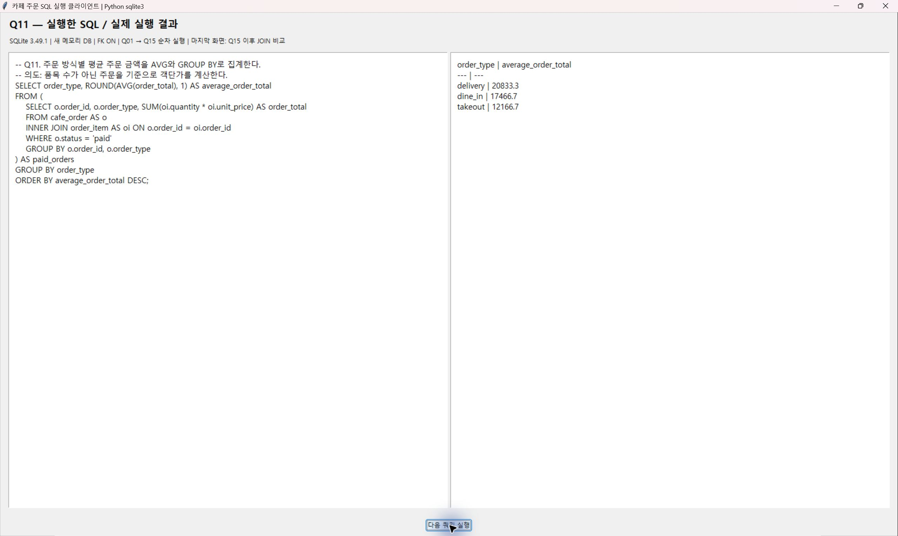
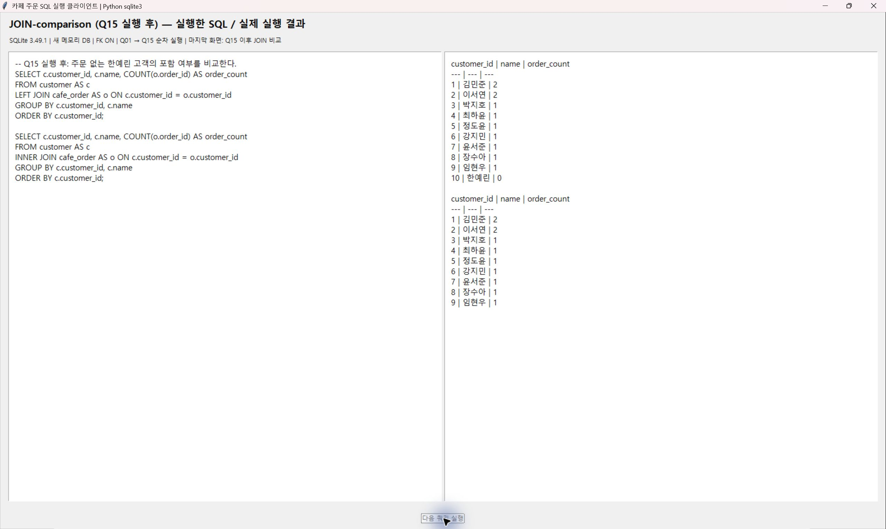

# SQL 실제 실행 화면

2026-09-20 Windows / Python 3.12.10 / SQLite 3.49.1에서 `python scripts/query_viewer.py`로 실행한 자체 SQLite 클라이언트의 원본 화면 캡처다. Python sqlite3가 SQL을 실행하고 tkinter가 SQL과 결과를 표시한다. 사전 작성된 결과 텍스트를 이미지로 변환한 자료가 아니다.

새 메모리 DB에 schema.sql과 seed.sql을 적재하고 FK를 활성화한 후 Q01→Q15를 순서대로 실행했다. Q01~Q13은 초기 시드, Q14는 주문 110 수정 후, Q15는 주문 112와 상세 삭제 후 결과다. 캡처는 해당 창만 저장했으며 이미지 합성이나 내용 편집을 하지 않았다.

[SQL 원본](../../sql/queries.sql) · [전체 텍스트 결과](../query_results.txt) · [실행 클라이언트 소스](../../scripts/query_viewer.py)

EXPLAIN QUERY PLAN의 숫자 필드는 SQLite 버전에 따라 달라질 수 있다. 이번 결과의 세 번째 필드 값은 203이며 인덱스 사용 여부는 detail의 SEARCH/USING INDEX로 확인한다.

| 쿼리 | 확인 내용 | 실제 캡처 |
| --- | --- | --- |
| Q01 | 지역 조건 검색 | [화면](Q01.jpg) |
| Q02 | 메뉴 가격 정렬 | [화면](Q02.jpg) |
| Q03 | 최근 주문 LIMIT | [화면](Q03.jpg) |
| Q04 | 결제 완료 포장 주문 | [화면](Q04.jpg) |
| Q05 | 주문·고객·직원 INNER JOIN | [화면](Q05.jpg) |
| Q06 | 상세·메뉴·분류 INNER JOIN | [화면](Q06.jpg) |
| Q07 | 주문별 SUM | [화면](Q07.jpg) |
| Q08 | 고객별 LEFT JOIN | [화면](Q08.jpg) |
| Q09 | 상태별 COUNT | [화면](Q09.jpg) |
| Q10 | 고객별 SUM: 매출 있는 8명 | [화면](Q10.jpg) |
| Q11 | 방식별 AVG: 주문 단위 평균 | [화면](Q11.jpg) |
| Q12 | 상관 서브쿼리: 전체 10명 | [화면](Q12.jpg) |
| Q13 | 인덱스 실행 계획 | [화면](Q13.jpg) |
| Q14 | UPDATE 1행 및 변경 상태 | [화면](Q14.jpg) |
| Q15 | DELETE 1행 및 CASCADE 결과 | [화면](Q15.jpg) |
| 보충 | Q15 이후 LEFT 10명(한예린 0건), INNER 9명 | [화면](JOIN-comparison.jpg) |

## JOIN 비교 해석

[비교 SQL과 결과](../join_comparison.txt)의 첫 번째 표는 LEFT JOIN, 두 번째 표는 INNER JOIN이다. 고객은 10명 그대로이며 주문 112가 삭제되어 고객 10 한예린만 주문이 없다. 초기 Q08 화면에는 주문이 1건이므로 실행 시점을 혼동하지 않는다.

## 대표 화면

재현하려면 Tk가 포함된 데스크톱 Python으로 실행한 뒤 다음 쿼리 실행 버튼을 누른다. 작은 화면에서는 창을 최대화하고 SQL과 모든 결과 행이 보이는지 확인한다. 컨테이너의 기존 실행 파이프라인은 텍스트/DB 재생성용이며 JPEG를 자동 갱신하지 않는다. SQL이나 시드를 바꿀 때는 화면도 다시 캡처해야 한다.
